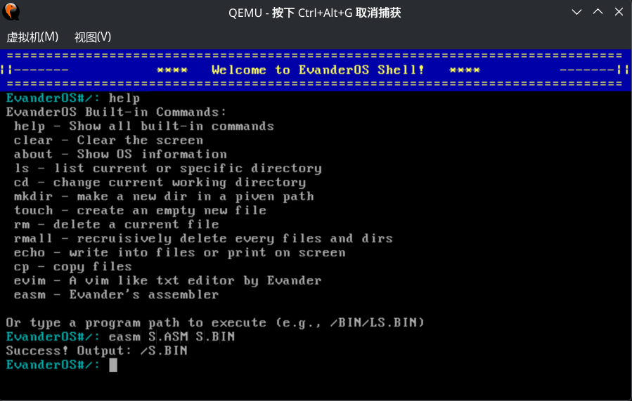
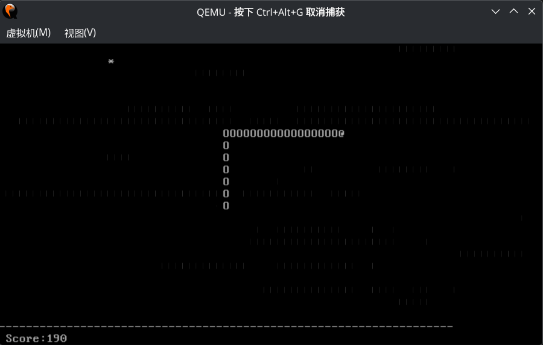
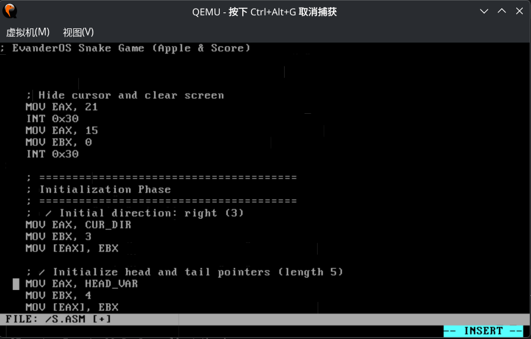

EvanderOS & easm & evim

 This is a toy OS project built for learning and pure entertainment. Don't expect to run Crysis on it, but if you like poking around bytes and registers, you're in the right place. 

English | 中文

English

🌟 About

EvanderOS is a "just-for-fun" text-mode 32-bit operating system running on x86. It's a playground where I hand-rolled everything from the bootloader to a custom assembler(but still don't support grub yet). It’s simple, slightly raw, and definitely not "production-ready," but it's a great way to see how an OS actually breathes.

🚀 The "Cool Stuff" Inside
user library: Serves as a bridge between syscalls and user programs. All user programs (./apps & ./user) are based on it.

shell: Simple shell with several builtin commands, type 'help' in command line for instructions.

**Note**: Case sensitivity matters! Use UPPERCASE for paths (e.g., /BIN) and lowercase for commands (e.g., ls). Long filenames are not supported.

easm (The Assembler): A home-grown x86 assembler. It handles the basic instructions, which supports 32-bit near jumps, label, 'db'. However since it's very simple, some instructions haven't been supported. But it means you may write your own os inside the os.

evim (The Editor): A tiny, Vim-inspired text editor. It supports two modes: Normal mode (for navigation) and Insert mode (for editing). Use 'i' to enter Insert mode, 'ESC' to return to Normal mode. In Normal mode: h/j/k/l for movement, 'Z' to save and exit, 'q' to quit directly with confirmation. In Insert mode: type normally, Backspace to delete, Enter for new line, Tab for 4 spaces.

FAT32 Support: It supports directories and complicated path navigation(like cd ../../bin).

Snake in ASM: Check out the apps/ folder for a Snake game written entirely in assembly. And you are able to compile it with the easm within qemu and launch the game successfully! 

🛠️ Build & Play

Prerequisites: nasm, gcc-multilib, qemu-system-i386, mtools.

# Bake the image
make

# Boot with qemu
make qemu

中文

🌟 关于

EvanderOS 是一个由学习&娱乐应运而生的简单（甚至有点简陋）的32位操作系统。从bootloader到汇编器全部手搓（还不支持grub）

纯属练手、为了娱乐而诞生的 32 位小系统。这里没有复杂的现代架构，只有硬核的字节和寄存器。虽然简单（甚至有点简陋），

🚀 里面的好东西
userlib（简单用户库）：作为syscall和用户程序调用的桥梁。所有用户程序(./apps & ./user)都基于它。

shell：简单shell界面，支持文件操作，输入help获得更多帮助。

**注意**：大小写敏感！路径使用大写（如 /BIN），命令使用小写（如 ls）。不支持长文件名。

easm (简单汇编器)：原生x86汇编器，支持基础指令及标签等，但复杂操作（如宏）尚未实现。不过无论如何，这意味着我们的os实现自举了。

evim (极简编辑器)：模仿vim写的简易终端文本编辑器。支持两种模式：普通模式（导航）和插入模式（编辑）。按'i'进入插入模式，'ESC'返回普通模式。普通模式：h/j/k/l移动光标，'Z'保存退出，'q'直接退出。插入模式：正常输入，退格删除，回车换行，Tab键4个空格。

FAT32 驱动：支持完整的目录树和路径规范化（比如你可以 cd ../../bin）。

纯汇编贪吃蛇：在 apps/ 目录下。系统启动后可以用easm编译并运行。

## 📸 Gallery

### EvanderOS Shell

*The nostalgic DOS-like interface*

### Snake Game

*Pure assembly text snake game running on custom OS*

### Self-Hosting Demo

*evim editor + easm assembler = bootstrap moment*

📄 License / 协议

Distributed under the MIT License.
本项目基于 MIT 协议 开源。